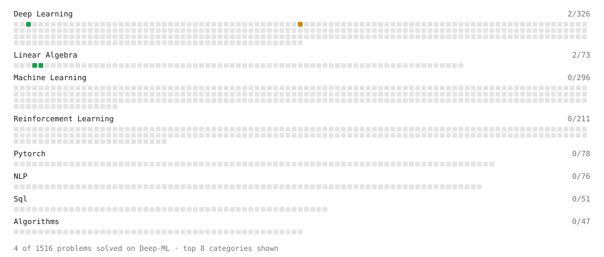

# Deep-ML

My machine learning practice from [Deep-ML](https://www.deep-ml.com). Every solution here was written by hand.

**3** solved · 3 problems · 0 labs · 0 math

[**Browse the interactive portfolio**](https://insultthumb.github.io/deep-ml/) to replay this filling in over time.

## Problems

| | Difficulty | Solved | |
| --- | --- | --- | --- |
| [Scalar Multiplication of a Matrix](https://www.deep-ml.com/problems/5) | easy | 2026-10-02 | [solution](problems/0005-scalar-multiplication-of-a-matrix) |
| [Single Neuron](https://www.deep-ml.com/problems/24) | easy | 2026-09-28 | [solution](problems/0024-single-neuron) |
| [Dropout Layer](https://www.deep-ml.com/problems/151) | medium | 2026-09-28 | [solution](problems/0151-dropout-layer) |

---

_This file is regenerated by Deep-ML on every push._
